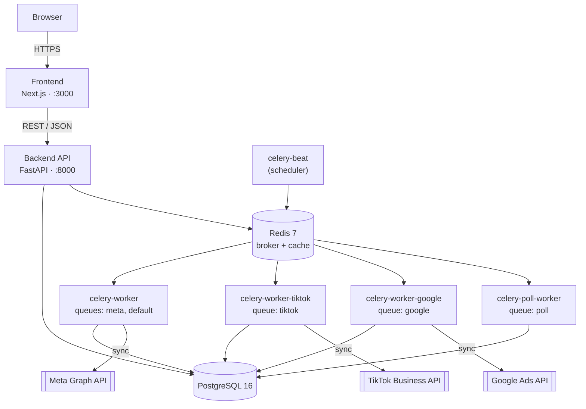

# dashmet — Architecture & Design Specification

> **Version:** 0.1
> **Status:** Draft
> **Companion to:** `docs/prd.md` (what dashmet does and why). This document covers how it's built: components, technology, data flow, and deployment.
> **As of:** 2026-08-05, `development` branch

---

## Table of Contents

1. [Purpose & Scope](#1-purpose--scope)
2. [System Overview](#2-system-overview)
3. [Technology Stack](#3-technology-stack)
4. [Component Architecture](#4-component-architecture)
5. [Data Flow](#5-data-flow)
6. [Multi-Tenancy & Security](#6-multi-tenancy--security)
7. [Deployment & Infrastructure](#7-deployment--infrastructure)
8. [Related Documents](#8-related-documents)

---

## 1. Purpose & Scope

`docs/prd.md` describes what dashmet does and why. This document describes how: the system's components, how they talk to each other, the technology behind them, and how it's deployed.

Where this document and a deep-dive spec (`docs/backend-api-spec.md`, `docs/frontend-spec.md`, `docs/sync-worker-spec.md`, `docs/internal-schema-spec.md`, `docs/erd.md`) disagree on a low-level detail, the deep-dive spec wins — this is the overview that ties them together, not a replacement for them.

## 2. System Overview

dashmet has four components sharing one PostgreSQL database:

- **Frontend** (Next.js) — talks only to the Backend API, over HTTP.
- **Backend API** (FastAPI) — the only component that serves HTTP requests to the frontend; reads and writes Postgres directly.
- **Background Workers** (Celery) — five separate worker processes (§4.3) that pull data from platform APIs on a schedule and write into the same Postgres database the API reads from.
- **Redis** — the message broker between the scheduler/API and the workers, and a general-purpose cache (rate-limit token buckets, AI-summary cache).

## 3. Technology Stack

| Layer | Technology |
|---|---|
| Frontend | Next.js 16 (App Router), React 19, TypeScript 5, Tailwind CSS 4, shadcn/ui 4, TanStack Query 5, Recharts 3 |
| Backend API | Python 3.12, FastAPI 0.115, SQLAlchemy 2 (async), Pydantic 2 |
| Background workers | Celery 5, Redis 7 (broker) |
| Database | PostgreSQL 16 |
| Infrastructure | Docker + Docker Compose |

A few choices exist specifically to support requirements in `docs/prd.md` §7, not just as defaults:
- **Async Python end-to-end** (FastAPI + SQLAlchemy async) so structure/insights syncs across three platforms can run concurrently without one blocking another.
- **PostgreSQL, not a schemaless store**, so the tenant-isolation and unique-constraint guarantees in NFR-2/NFR-4 are enforced by the database itself, not only by application code.
- **TanStack Query on the frontend** so read data is cached client-side against a known stale-time instead of refetched on every render (NFR-8).
- **Per-platform Celery queues** (§4.3) so a rate-limit backoff on one platform never blocks another platform's syncs.

## 4. Component Architecture

### 4.1 Frontend
Next.js 16, App Router. Route groups: `(auth)` (login/signup/verify/reset) and `(dashboard)` (per-platform views + settings). Server state lives in TanStack Query; local UI state (e.g. sidebar collapse) in a small Zustand store; shareable view state (date range, compare toggle, selected account) lives in the URL via `nuqs`. The frontend never talks to Postgres, Redis, or a platform API directly — every data access goes through a typed function in `frontend/src/lib/api/*.ts`, which calls the Backend API.

### 4.2 Backend API
FastAPI, single `v1` surface (`backend/app/api/v1/`). Layering is endpoint → service → SQLAlchemy async session: endpoints parse/validate the request and call one service function; services own business logic and query the database; endpoints don't query the database directly (`docs/prd.md` NFR-7 — one current exception is tracked as a known gap, `docs/prd.md` §9). Auth is JWT (HS256, one shared secret) — a single-service deployment doesn't need the asymmetric access/refresh key-pair scheme a multi-service architecture would require to let independently-deployed services verify tokens without sharing a secret.

### 4.3 Background Workers
Celery, five worker processes plus one beat scheduler, each its own `docker-compose.yml` service:

| Process | Queue(s) | Concurrency | Purpose |
|---|---|---|---|
| `celery-worker` | `meta`, `default` | 4 | Meta Ads structure + insights sync |
| `celery-worker-tiktok` | `tiktok` | 4 | TikTok Ads structure + insights sync |
| `celery-worker-google` | `google` | 4 | Google Ads structure + insights sync |
| `celery-poll-worker` | `poll` | 2 | Polls Meta's async insights report jobs to completion |
| `celery-beat` | — (scheduler, no queue consumption) | — | Fires scheduled sync tasks on a recurring cadence |

Each platform gets its own queue and worker process so a rate-limit backoff on one platform's connection never blocks another platform's syncs — they're physically separate processes, not just separate task types on a shared pool. Rate-limit backoff itself is non-blocking and scoped to the specific connection whose token is paused (a Redis token bucket), so a slowdown on one organization's Meta connection doesn't stall other organizations' Meta syncs either. Per an inline comment in `docker-compose.yml`, this is designed to scale horizontally by running more replicas of a given worker service (`docker compose up --scale celery-worker=N`, or the equivalent in a container orchestrator) rather than by raising concurrency indefinitely on one container.

Full task-level behavior (retry policy, rate-limit thresholds, fetch ordering) is in `docs/sync-worker-spec.md`.

### 4.4 Database
PostgreSQL 16, single schema. One normalized structural hierarchy (`account → campaign → ad_group → ad → creative`) plus a shared, platform-agnostic metrics layer (`metrics_daily`, `metric_action_stats`, `metric_breakdowns`) so every platform writes through the same shape. Full schema reference in `docs/internal-schema-spec.md`; diagrams in `docs/erd.md`.

## 5. Data Flow

### 5.1 Read path (a dashboard request)
Browser → Next.js → a typed function in `lib/api/*.ts` → FastAPI endpoint → service function → SQLAlchemy async session → Postgres → response shaped by a Pydantic schema → cached client-side by TanStack Query against a stale-time.

### 5.2 Write path (a sync)
Celery Beat fires on schedule (or a connection triggers an eager first sync, or a user manually triggers one) → a task is queued on the platform-specific Redis queue → the matching worker process picks it up → a `sync_jobs` row is committed with status `running` *before* any external call, in its own transaction → the worker calls the platform's API (Meta Graph API / TikTok Business API / Google Ads API) → the response is normalized into the shared schema → upserted into Postgres → the `sync_jobs` row is finalized (`completed` or `failed`) in a separate transaction, so a hard crash mid-sync still leaves a record rather than an unexplained gap.

## 6. Multi-Tenancy & Security

- Every account belongs to exactly one organization. Every query touching account-scoped data must resolve to the requesting user's accessible account IDs before it runs — see `docs/erd.md` §7 for where this is (and isn't) enforced at the database level versus application code.
- Organization owners have unrestricted access to every account in their org; members are scoped to accounts explicitly granted via `membership_accounts`.
- Platform OAuth tokens are stored encrypted at rest.
- Auth is JWT-based, issued and verified by the one backend service (§4.2).

Production-grade concerns not yet documented anywhere in this repo: secrets management/rotation strategy, TLS termination, and network topology beyond local Docker Compose. Flagged here rather than assumed.

## 7. Deployment & Infrastructure

Docker Compose orchestrates every service for local development (`docker-compose.yml`):

| Service | Port | Notes |
|---|---|---|
| `frontend` | 3000 | Next.js dev server (`npm run dev`), live-mounted source |
| `backend` | 8000 | FastAPI with `--reload`; API docs at `/api/docs`; live-mounted source |
| `postgres` | 5432 | `postgres:16-alpine`, healthchecked |
| `redis` | 6379 | `redis:7-alpine`, healthchecked |
| `celery-worker` / `-tiktok` / `-google` / `-poll-worker` / `-beat` | — (no exposed port) | Connect to `redis` + `postgres` over the compose network |

All backend-family containers build from `./backend` and mount it as a live volume — this compose file is a development setup (`--reload`, `npm run dev`), not a production image build. Required secrets (`SECRET_KEY`, `ENCRYPTION_KEY`) are generated locally per `README.md` and supplied via `backend/.env` / `frontend/.env.local`, neither of which is committed.

**Gap:** production deployment topology — whether these run as the same set of services, how they're scaled/orchestrated outside Compose, TLS, secrets management — is not documented anywhere in this repo today.

## 8. Related Documents

| Doc | Covers |
|---|---|
| `docs/prd.md` | Product requirements — what and why |
| `docs/backend-api-spec.md` | REST API contract, endpoint by endpoint |
| `docs/frontend-spec.md` | Frontend routes, components, state management |
| `docs/sync-worker-spec.md` | Celery task logic, rate limiting, retry behavior |
| `docs/internal-schema-spec.md` | Database schema, prose reference |
| `docs/erd.md` | Database schema, entity-relationship diagrams |
| `docs/tasks.md` | Whole-product task board |
