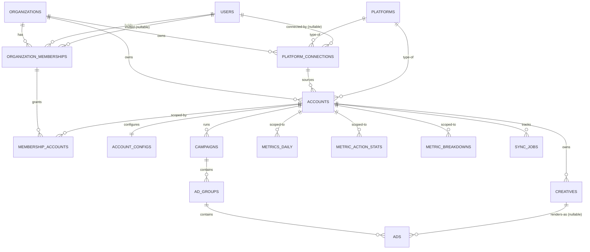
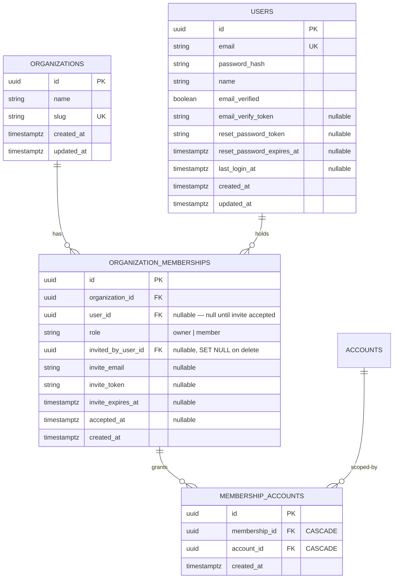
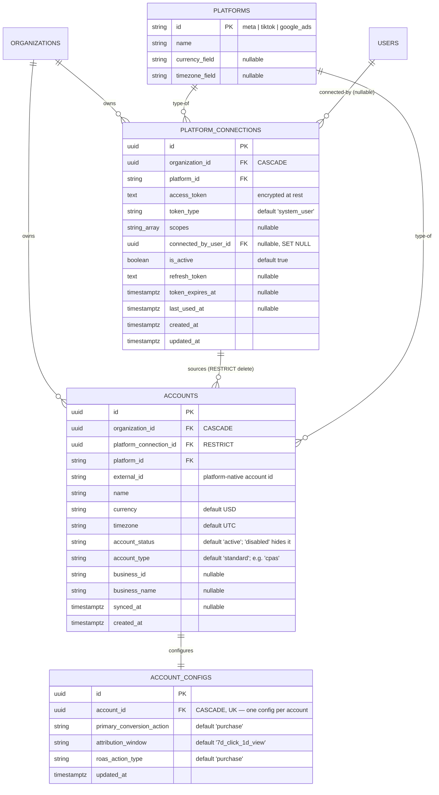
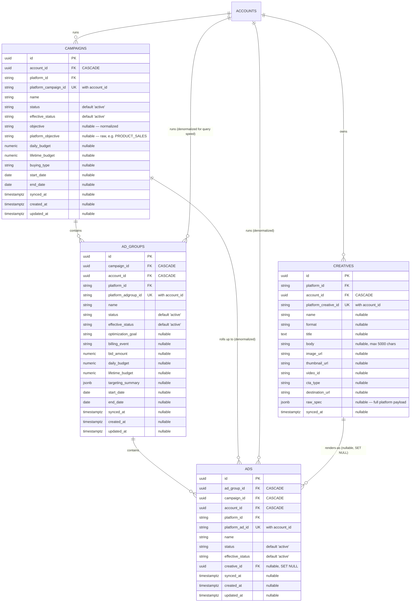
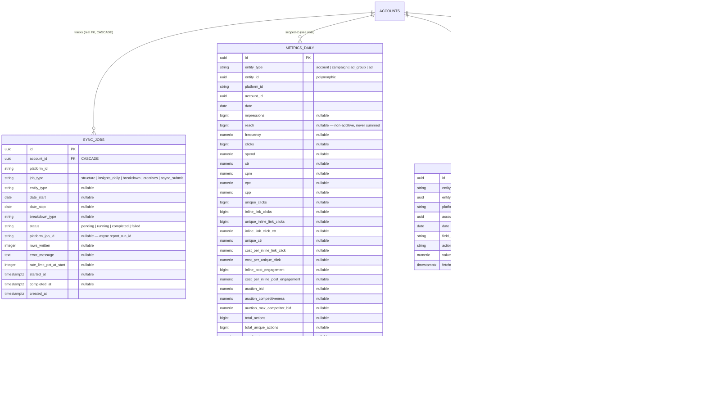

# dashmet — Entity Relationship Diagram

> **Version:** 0.1
> **Status:** Draft
> **Scope:** Full ER model of the PostgreSQL schema in `backend/app/models/`.
> **Companion doc:** [`docs/internal-schema-spec.md`](./internal-schema-spec.md) — field-by-field prose reference, query patterns, action-type dictionary. §8 of that doc has a short ASCII sketch; this file is the full diagram it points to.

---

## Table of Contents

1. [How to read this](#1-how-to-read-this)
2. [Full schema overview](#2-full-schema-overview)
3. [Tenancy & access layer](#3-tenancy--access-layer)
4. [Platform & account layer](#4-platform--account-layer)
5. [Structural hierarchy](#5-structural-hierarchy)
6. [Metrics & sync layer](#6-metrics--sync-layer)
7. [Notes](#7-notes)

---

## 1. How to read this

- Diagrams are [Mermaid `erDiagram`](https://mermaid.js.org/syntax/entityRelationshipDiagram.html) blocks — they render inline on GitHub and most markdown viewers.
- `PK` = primary key, `FK` = foreign key, `UK` = part of a unique constraint. A column with none of these is a plain attribute.
- Relationship lines use standard crow's-foot notation: `||` = exactly one, `o{` = zero-or-many, `||--||` = exactly one-to-one.
- Every table also carries a surrogate `uuid id PK` (via `UUIDPrimaryKeyMixin`), shown in every entity block below.
- Three tables (`metrics_daily`, `metric_action_stats`, `metric_breakdowns`) key off a polymorphic `entity_type` + `entity_id` pair rather than a single foreign key — see [§7](#7-notes) for what that means for the diagram.

---

## 2. Full schema overview

Bird's-eye view — entity names and cardinality only. See §3–§6 for full attribute lists per layer.

---

## 3. Tenancy & access layer

Corresponds to `docs/internal-schema-spec.md` §2. Governs who can see which organization's data, and — since per-member account access shipped — which accounts within it.

**Unique / partial-unique constraints:**
- `organizations`: `slug`
- `users`: `email`
- `organization_memberships`: `(organization_id, user_id)`; plus a **partial** unique index `(organization_id, invite_email) WHERE invite_email IS NOT NULL` — prevents duplicate pending invites to the same email before the invitee has a `user_id`.
- `membership_accounts`: `(membership_id, account_id)`

**Access model:** owners are unrestricted (implicit access to every org account, no `membership_accounts` rows needed). Members see only accounts explicitly granted via `membership_accounts` — no row means no access. Both FKs cascade, so removing a member or an account drops the grant automatically.

---

## 4. Platform & account layer

Corresponds to `docs/internal-schema-spec.md` §3 ("Platform & Account Layer").

**Unique constraints:** `accounts (organization_id, platform_id, external_id)`; `account_configs (account_id)`.

**Why `platform_connection_id → accounts` is `ON DELETE RESTRICT`, not `CASCADE`:** disconnecting a platform connection must not silently delete historical account/metrics data — the connection has to be explicitly handled first. Every other tenancy foreign key cascades; this one deliberately doesn't.

---

## 5. Structural hierarchy

Corresponds to `docs/internal-schema-spec.md` §3 ("Structural Hierarchy"). Platform-agnostic naming: Meta "Ad Sets," Google "Ad Groups," TikTok "Ad Groups" are all `ad_group` internally.

**Unique constraints:** `campaigns (account_id, platform_campaign_id)`; `ad_groups (account_id, platform_adgroup_id)`; `ads (account_id, platform_ad_id)`; `creatives (account_id, platform_creative_id)`.

**Note:** `account_id` on `ad_groups` and `ads` duplicates what's derivable by walking `campaign_id`/`ad_group_id` up the tree — intentional denormalization so any metrics/access query can filter on `account_id` directly at any level.

---

## 6. Metrics & sync layer

Corresponds to `docs/internal-schema-spec.md` §4–§5. This is where the polymorphic pattern lives: one metrics row can belong to an `account`, `campaign`, `ad_group`, or `ad`, discriminated by `entity_type` + `entity_id` rather than four separate nullable foreign-key columns.

**Unique constraints:**
- `metrics_daily`: `(entity_type, entity_id, date)` — note this does not currently include `attribution_window`; see §7.
- `metric_action_stats`: `(entity_id, date, field_name, action_type)`
- `metric_breakdowns`: `(entity_id, date, breakdown_type, breakdown_value)`
- `sync_jobs`: no unique constraint (multiple rows per account/type/day are expected — one per sync attempt); indexed on `(account_id, job_type, status)` and `(job_type, status, platform_job_id)` for the async poll loop.

---

## 7. Notes

**Polymorphic association, not a modeled foreign key.** `metrics_daily`, `metric_action_stats`, and `metric_breakdowns` key off `entity_type` (a string discriminator: `account | campaign | ad_group | ad`) + `entity_id` (a bare `uuid`). A single column can't declare a foreign key to four different parent tables, so referential integrity here is enforced by application code and tests, not the database. Every query against these tables must filter by `account_id` values that belong to the requesting user's `organization_id` — never trust a client-supplied `account_id` alone.

**`account_id` and `platform_id` on the three metrics tables are plain columns, not foreign keys** — same reasoning as above (a metrics row's real anchor is the polymorphic `entity_id`; `account_id` is a denormalized convenience column for fast scoping). `sync_jobs.account_id` is the one exception in this layer — it references exactly one table, so it's a real foreign key with `ON DELETE CASCADE`.

**`attribution_window` is not part of `metrics_daily`'s unique constraint.** The column exists, but `uq_metrics_daily_entity_date` only covers `(entity_type, entity_id, date)`. In practice, this means an upsert keyed on that constraint could overwrite one attribution window's spend with another's if an account's window setting ever changes or a backfill runs under a different window than the original sync. Flagged in `docs/prd.md` §9 as a known gap.

**`platforms` is intentionally a tiny lookup table** (`id`, `name`, `currency_field`, `timezone_field`) for the three currently-integrated platforms (`meta`, `tiktok`, `google_ads`) — not a general config store.
